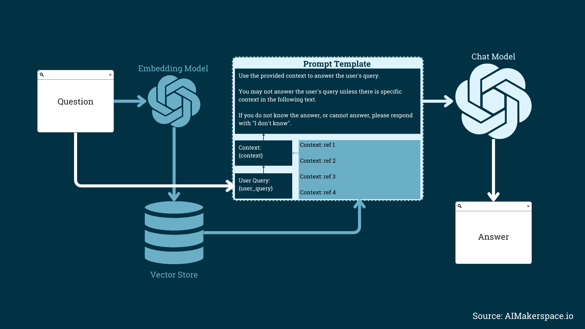

# Introduction to RAG Evaluation

📏 Evaluation gives you concrete numbers that tell you how accurate the system is, how relevant its answers are, and how well it's working overall.

🔍 With an evaluation system, you can:

- 📊 Compare different models, prompts, contexts, and retrieval strategies to determine what works best.

- 📈 Assess the quality of your RAG pipeline over time.

- Determine what part of the pipeline needs improving and how to improve it.

## Recall the basic steps in creating a RAG system

 - 📚 Create an Index

 - 🔎 Retrieval of relevant context from our Index that is similar to our query

 - 🤖 Generate responses based on the retrieved context by injecting the retrieved context into a prompt and sending that to an LLM

Diagram illustrating the components of a RAG system, including the retriever and generator processes.

Source: [AI Makerspace](https://youtu.be/Anr1br0lLz8)

## You can essentially think of a RAG system as consisting of two components

Those components are:

1) Retrieval

2) Generation

### Retrieval

The retrieval component fetches relevant information from external knowledge sources to inform the generation process. This itself is two main phases: indexing and searching.

**📚 Indexing phase:** Documents are organized for efficient retrieval

**🔍 Searching phase:** Indexes are used to fetch relevant documents based on the user's query

**Retrieval component challenges:**

 - Evaluating effectiveness in filtering and selecting pertinent information

 - Assessing the relevance and usefulness of retrieved data

### Generation

The generation component takes the retrieved context passages and the original query as input to generate a coherent and contextually appropriate output.

**Generation component challenges:**

 - Ensuring LLM utilizes retrieved context passages effectively

 - Assessing factual correctness, relevance, and coherence

## How to evaluate these components

**Retrieval Evaluation: Are the retrieved sources relevant to the query?**

- Evaluate how well the retrieved documents match the information needed in the query

- Assess how accurate the retrieved documents are compared to a set of candidate documents

- Measure the system's ability to identify and score relevant documents higher than less relevant or irrelevant ones

**Generation Evaluation: Does the response match the retrieved context and the query?**

- Measure how well the generated response aligns with the intent and content of the initial query

- Evaluate if the generated response accurately reflects the information contained within the source documents

## The two main aspects of evaluation:

1. 📊 Quality

2. 🏹 Ability

### 📊 Quality

Quality is measured via:

- **🎯 Relevance:** Ensure the retrieved context is precise and the generated answers directly relate to the user's query.

- **🤝 Faithfulness:** Ensure the generated responses are consistent with the retrieved context and do not contain contradictions or inconsistencies.

### 🏹 Ability

Ability encompasses various factors such as:

- **🔇 Noise Robustness:** Handle noisy contexts effectively.

- **🙅‍♂️ Negative Rejection:** Know when to admit lack of knowledge.

- **🧩 Information Integration:** Combine information from multiple sources.

- **🔮 Counterfactual Robustness:** Identify and ignore misinformation.

## In the next section, I'll give a brief overview of the three core evaluation metrics.