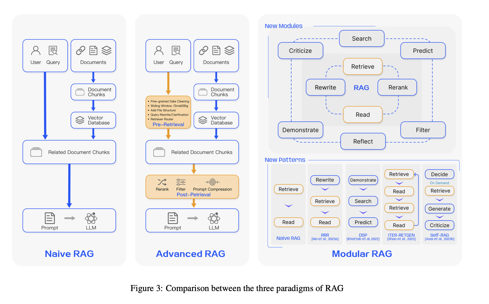

# 🌟 **Improving on Naive RAG**

[Source: Retrieval-Augmented Generation for Large Language Models: A Survey](https://arxiv.org/abs/2312.10997)

| RAG Paradigm  | Key Techniques |
|---------------|----------------|
| **Naive RAG** | 1. **Indexing:** Data cleansing, extraction, chunking, and vectorization 2. **Retrieval:** Similarity comparison between query and indexed chunks 3. **Generation:** Synthesizing query and retrieved documents into a prompt for LLM response |
| **Advanced RAG** | **Pre-Retrieval Process:** 1. Optimizing data indexing (enhancing granularity, structure, metadata, alignment, mixed retrieval) 2. Fine-tuning embedding models for domain-specific relevance 3. Using dynamic embeddings  **Post-Retrieval Process:** 1. Re-ranking retrieved information (diversity ranking, alternating best document placement, recalculating semantic similarity) 2. Prompt compression (importance estimation, granular compressors, summarization) |
| **Modular RAG**  | 1. Integrating new modules (e.g., search module for specific scenarios, memory module for retrieval guidance) 2. Allowing serialized pipeline or end-to-end training across modules 3. Inheriting and building upon Advanced RAG techniques |

# **Pre-retrieval Optimization**

| Enhancement | Description |
|-------------|-------------|
| 🔍 Enhance Data Granularity | Improves text standardization and factual accuracy, removes ambiguities, and incorporates domain-specific annotations. |
| 📊 Optimize Index Structures | Utilizes varied chunk sizes and multiple index paths, and introduces graph structures for better accuracy. |
| 📑 Metadata Utilization | Incorporates metadata like dates and chapters into chunks to improve filtering and relevance. |
| 📐 Alignment Optimization | Aligns hypothetical questions with document content to reduce discrepancies. |
| 🎨 Mixed Retrieval Techniques | Combine keyword, semantic, and vector searches to ensure relevant and rich information retrieval. |

# **Enhancements in Embeddings**

| Enhancement | Description |
|-------------|-------------|
| 🎯 Fine-tuning Embedding Models | Tailor embeddings specifically for domain relevance, using advanced models and training data. |
| 🌐 Dynamic Embedding Approaches | Adopts embeddings that adjust based on context, enhancing the connection between retrieved content and queries. |

# **Post-retrieval Improvements**

| Enhancement | Description |
|-------------|-------------|
| 🏆 ReRank Strategies | Prioritizes the most relevant documents using advanced frameworks and re-ranking methods. |
| 🗜️ Prompt Compression | Reduces noise by compressing irrelevant context and highlighting crucial information, improving focus and response quality. |

# **RAG Pipeline Optimization**

| Optimization | Description |
|--------------|-------------|
| 🔀 Hybrid Search Methods | Integrate different search techniques to adapt to various query types and enhance information retrieval. |
| 🔄 Recursive Retrieval and Query Engines | Utilizes recursive techniques for efficient retrieval, starting with smaller blocks and expanding as needed. |
| 🔙 StepBack-prompt Approach | Encourages broader reasoning by the LLM, improving inference and general concept understanding. |
| 🔍 Subqueries and HyDE | Implements diverse querying strategies and hypothetical document generation for enhanced retrieval accuracy and performance. |